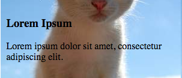
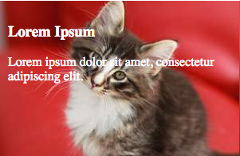

# Тестовое задание на должность Frontend-разработчика

## Clause

Репозиторий с решением должен состоять только из содержимого папки exam и вашим кодом.
Разрешается выполнять задание на React или Angular если вы не знаете Vue, во всех других случаях использование Vue в приоритете.
Использование typescript или других компилируемых в js языков нежелательно

## Задание

Создать одностраничное приложение (SPA) по макету


Размер плитки подбирается исполнителем, но должен быть одинаковым для всех "нормальных" и соответствовать половине ширины двойной плитки. Подробности в разделе описания [API](#API).

Расстояние между плитками не имеет значение. Можно делать вообще без паддинга, важно лишь его соблюдение.

Каждая плитка должна иметь картинку на заднем плане. Рекомендуется использовать [http://placekitten.com/](http://placekitten.com/). Картинка должна быть отцентрирована и подобрана таким образом, чтобы всегда была видна "смысломая часть изображения"

Плохо:



Хорошо:



Каждая плитка должна быть ссылкой или содержать ссылку на соответствующую статью, которая должна открываться по клику. _Помните о том, что вы делаете SPA_

Текст плитки должен быть хорошо читаемым. Так что пример выше с "хорошо" -- тоже плохо

Верстка должна быть семантичной, кроссбраузерной, адаптивной

Список поддеживаемых браузеров
```json
"browserslist": [
    "> 1%",
    "last 2 versions",
    "safari >= 7",
    "ie >= 10"
]
```

### Адаптивность

#### Desktop (viewport width > 1024px)
Плитки должны распологаться в 3 столбца

#### Tablet (viewport width =< 1024px)
Плитки должны распологаться в 2 столбца, плитка двойного размера занимает всю строку

#### Mobile (viewport width < 480px)
Плитки должны распологаться в один столбец шириной во всесь экран. При этом тип плитки игнорируется.

## Установка и запуск

```bash
npm i
npm start
```

## API
Работа сервера зарыта мок объектом, содержащим ответ в формате json
```json
[
  {
    "id": 1,
    "type": "normal",
    "title": "Lorem Ipsum",
    "description": "Lorem ipsum dolor sit amet, consectetur adipiscing elit.",
    "text": "Lorem ipsum dolor sit amet, consectetur adipiscing elit. Curabitur elementum dolor in orci laoreet faucibus. Maecenas faucibus vulputate velit, eu rhoncus mi convallis non. Vestibulum et neque vel nisl convallis ultricies. Interdum et malesuada fames ac ante ipsum primis in faucibus. Donec accumsan ornare ipsum ac rutrum. Nulla odio urna, porta ut pretium eget, pharetra a leo. Aliquam pharetra tempus ex, vel sodales massa venenatis sit amet. Phasellus ut tortor egestas, placerat leo nec, mattis sapien. Praesent fermentum magna eu hendrerit dapibus. Duis mauris ex, pretium et faucibus non, facilisis at odio. Cras eget augue eros."
  }
];
```

__id__: {Numeric} Идентификатор

__type__: {('normal'|'double')} Тип плитки. Ширины плиток normal и double должны отличаться в 2 раза. Высоты при этом одинаковые и задаются в стилях исполнителем

__title__: {String} Заголовок, отображаемый в плитке и заглавии статьи

__description__: {String} Краткое описание статью. Показывается толлько в плитке

__text__: {String} Полный текст статьи. Отображается только внутри статьи

Вы можете изменить содержание ответа, дополнить, но сохраняя общую структуру

## Инструментарий

Для успешного выполнения задания необходимо использовать:
* [webpack](https://webpack.js.org) >= 2
* [Vue](https://vuejs.org) >= 2
* [Vue-Router](https://router.vuejs.org)
* [БЭМ](https://ru.bem.info/methodology/naming-convention/)

Дополнительный плюс за использование:
* [Vuex](https://vuex.vuejs.org)
* [SSR](https://ru.vuejs.org/v2/guide/ssr.html)

__Внимание!__ Запрещается использовать css фреймворки, прочие UI фреймворки с готовыми компонентами. Мы хотим оценить ваше знание css.

Все остальные библиотеки -- на усмотрение исполнителя.

## Содержание данного репозитория

### .babelrc

Для вашего удобства мы уже настроили babel c предустановками:
* `env`
* `stage-2` предложения в ECMAScript

Для асинхронной загрузки компонентов подключен плагин `syntax-dynamic-import`, но это не входит в обязательную программу

### webpack.config.js

Для разработки и проверки залания используется `webpack-dev-server`
```json
host: "localhost",
port: 9000
```

Для доступа к данным плиток использовать url `/api/tiles`, настроенный в методе `setup` директивы `devServer`

Файл `index.html` формируется динамически с помощью `html-webpack-plugin` и `html-webpack-template`. В него уже включен минимальный набор блоков и правил:
 * `<div id="app"></div>`, в который встраивается приложение
 * `<meta content="ie=edge" http-equiv="x-ua-compatible">`
 * `<meta content="width=device-width, initial-scale=1" name="viewport">`

 Для большей кастомизации можно использовать опции из `html-webpack-template` или создать собственный шаблон.

### api/tiles.json

Мок объект ответа сервера на запрос к API получения всех статей

## Критерии оценки

Правильность исполнения, лаконичность и красота кода превалирует над внешним видом страницы

## Заключение

Ожидаемое суммарное время выполнения задания -- в пределах трёх часов. Если вы легко уложились и нашли задание слишком простым, и хотите продемонстрировать что-то ещё -- предлагайте доработки с оценкой времени, которое потребуется на их реализацию. Также в этом случае мы готовы рассмотреть вопрос оплаты времени, затраченного на доработки.
