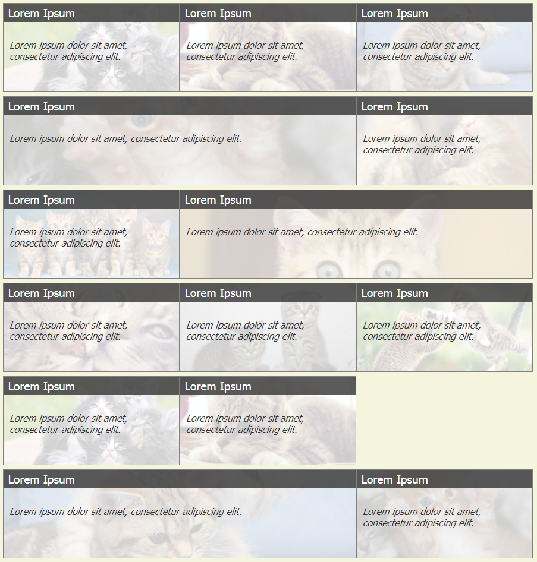
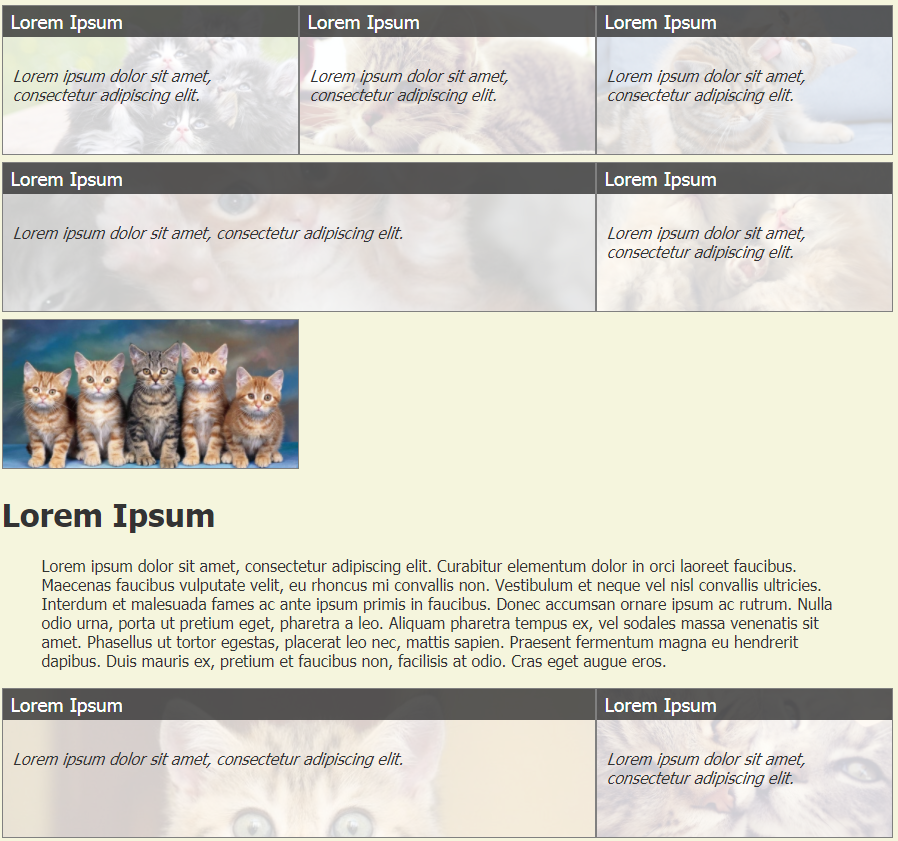
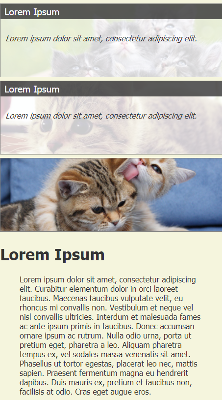

# Описание решения задачи

## Скриншоты

1. Общий вид страницы

2. Выделена одна из статей

3. Экран мобильника

## Примечания

1. http://placekitten.com/ не работает, поэтому я позволил себе наполнить папку `public` картинками.
2. Нажмите на кошку, чтобы открыть статью. Нажмите второй раз, чтобы скрыть стаью.
3. При раскрытой статье блок с кошкой будет подсвечен, а текст в блоке спрятан, чтобы не дублировать.

## Что хотелось бы добавить

1. Сейчас раскрытие и закрытие статьи происходит довольно резко. Можно добавить анимации с помощью jquery. Либо пересмотреть решение. Мне хотелось, чтобы статья открывалась на той же странице. Вероятно, статья будет большая. В этом случае блоки с котейками можно сместить в виде линейки сбоку.
2. Я не стал добавлять хедеры и футеры, не стал подбирать стиль страницы, а сконцентрировался на требованиях - сделать блоки и котейками и читаемый текст.
3. Сейчас логики размещения блоков нет, они размещены по порядку, поэтмоу остаются дырки. Можно добавить логики, которая позволит выполнить выравнивание. Но такое выравнивание зависит от бизнес-логики. Например, на фронте мы не можем менять сортировку блоков если она задана сервером. 